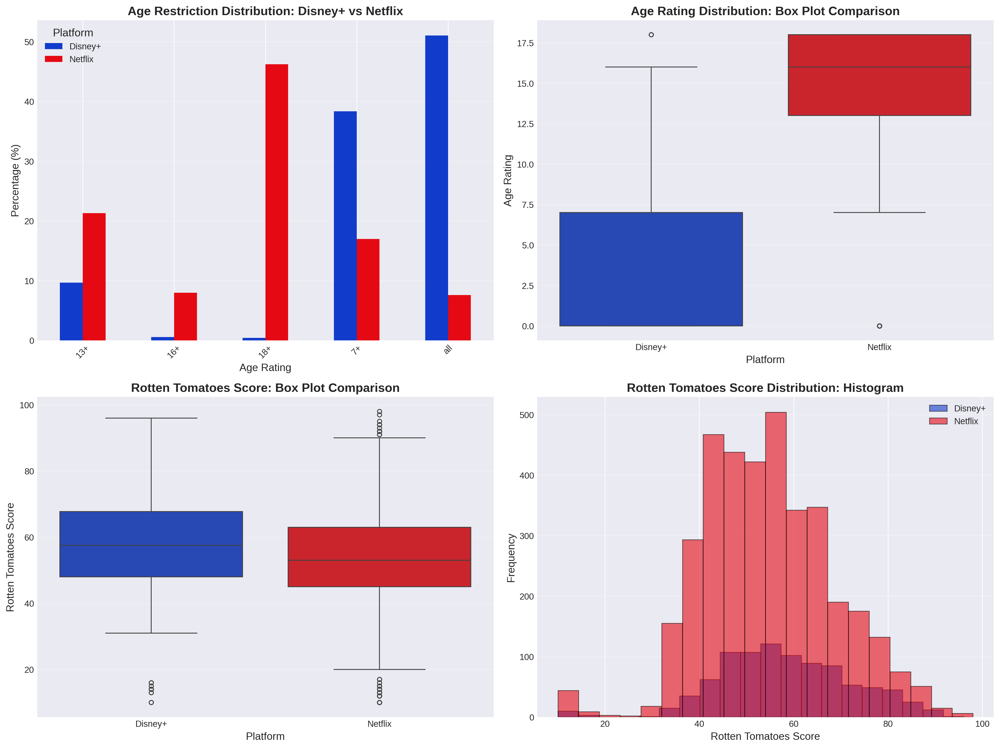
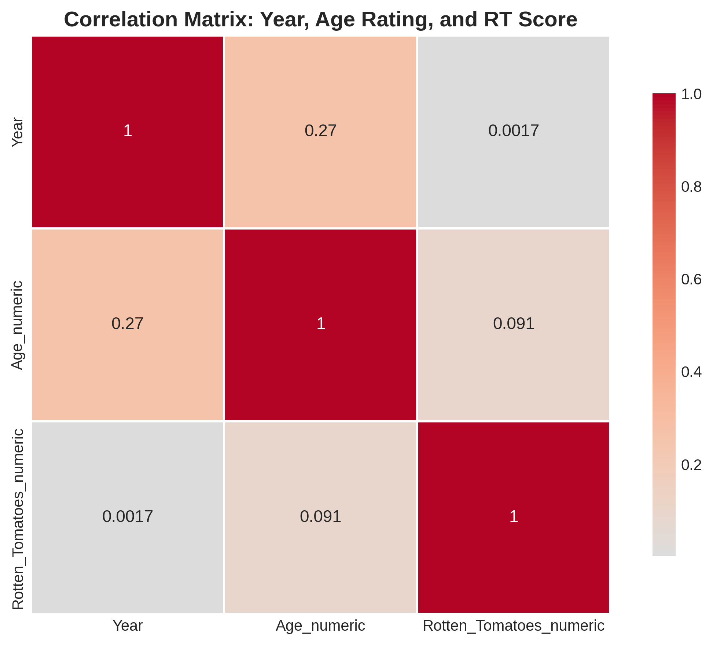

This is a professional and visually engaging **README.md** designed for a GitHub repository. It reflects the high academic standard of your TU Dortmund application while showcasing your technical skills to potential recruiters or peers.

---

# Streaming Platform Analysis: Disney+ vs. Netflix 🍿
> **Master Data Science Application Project | TU Dortmund University**


## 📌 Project Overview
This repository contains a comprehensive data analysis project investigating the content strategies of two streaming giants: **Disney+** and **Netflix**. The study focuses on two primary dimensions:
1.  **Content Maturity:** Is Disney+ truly "family-friendly" compared to Netflix?
2.  **Content Quality:** Which platform offers higher-rated movies according to critics?

This project was developed as part of the application process for the **M.Sc. Data Science at TU Dortmund University (Summer Semester 2025)**.

## 📊 Key Findings
*   **Maturity Gap:** Disney+ maintains a significantly lower age restriction profile. While Netflix's median movie is rated **16+**, Disney+'s median movie is rated **"All"**. 
*   **Quality Advantage:** Disney+ movies have a statistically significant lead in quality, with a mean Rotten Tomatoes score of **58.31%** vs. Netflix's **54.45%**.
*   **Effect Size:** The difference in maturity is massive (Rank-Biserial Correlation = **0.758**), whereas the difference in quality is real but subtle.

## 🗂 Dataset
The analysis uses the **"Movies on Netflix, Prime Video, Hulu and Disney+"** dataset from Kaggle.
*   **Total Observations:** 9,515 movies.
*   **Features Used:** Title, Year, Age Rating, Rotten Tomatoes Score, and Platform Flags.

## 🛠 Methodology
### 1. Data Preprocessing
*   **Mapping:** Converted categorical age ratings (all, 7+, 13+, 16+, 18+) into an ordinal numeric scale.
*   **Cleaning:** Extracted numeric values from Rotten Tomatoes strings (e.g., "80/100" → 80).
*   **Filtering:** Focused exclusively on movies available on Disney+ and Netflix.

### 2. Statistical Framework
*   **Normality Testing:** Shapiro-Wilk tests confirmed that neither age ratings nor quality scores followed a normal distribution ($p < 0.05$).
*   **Hypothesis Testing:** Employed the **Mann-Whitney U Test** (non-parametric) to compare the medians of the two platforms.
*   **Effect Size:** Calculated **Rank-Biserial Correlation** to determine the practical significance of the results.

## 📈 Visualizations

### Maturity & Quality Distribution
The bar charts and box plots below highlight the stark contrast in audience targeting and the slight edge Disney+ holds in critical reception.



### Density Analysis
The violin plots illustrate the "density" of content. Netflix has a heavy concentration of adult-oriented (18+) content, while Disney+ dominates the G-rated ("all") space.


### Correlation Matrix
Exploring the relationship between the year of release, maturity, and ratings.


## 🚀 Getting Started

### Prerequisites
*   Python 3.8+
*   `pandas`, `numpy`, `matplotlib`, `seaborn`, `scipy`

### Installation
1. Clone the repository:
   ```bash
   git clone https://github.com/yourusername/streaming-platform-analysis.git
   ```
2. Install dependencies:
   ```bash
   pip install -r requirements.txt
   ```
3. Run the analysis:
   ```bash
   python analysis_script.py
   ```

## 📂 Repository Structure
*   `analysis_script.py`: Full Python pipeline for cleaning, testing, and plotting.
*   `Application_Report.pdf`: The final 10-page academic report (LaTeX).
*   `figures/`: Generated PNG visualizations.
*   `data/`: Contains the raw CSV (or instructions to download from Kaggle).

## 🎓 Academic Context
This project follows the strict guidelines of the **Department of Statistics at TU Dortmund**. It emphasizes:
*   Mathematical definitions of statistical methods.
*   Rigorous hypothesis testing assumptions.
*   Neutral, scientific interpretation of results.


